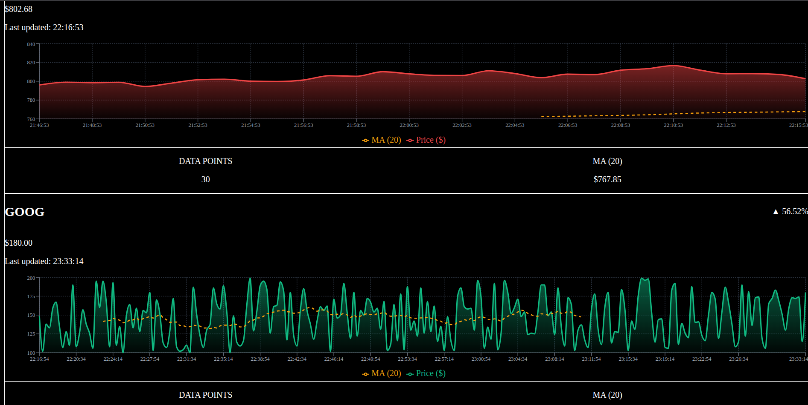
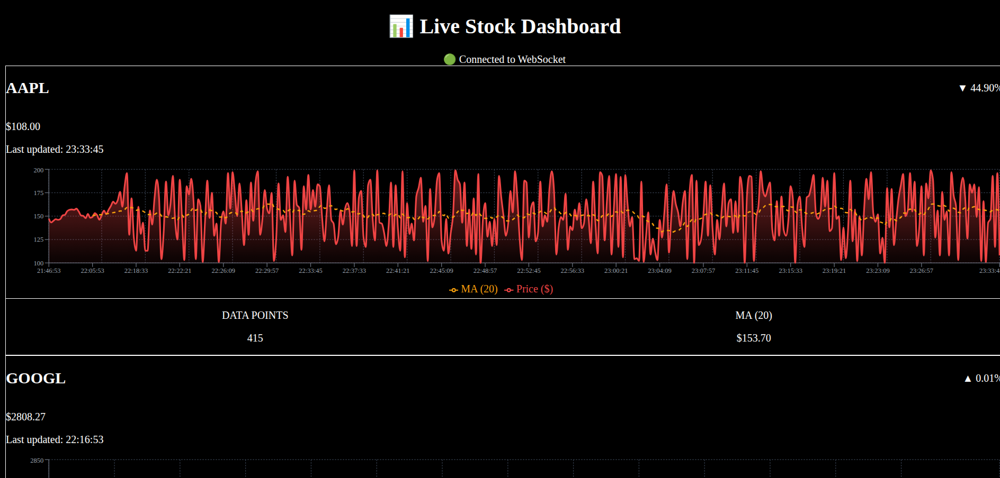

# 🚀 Multithreaded Stock Price Simulator


A **real-time stock price simulator** built using **C++ multithreading** (Producer–Consumer model) for backend and a **React-based frontend** for visualization.

The backend generates live stock price updates via **multiple producer threads**, while **consumer threads** process and broadcast data using a thread-safe queue. The frontend consumes this data over **WebSockets** and displays it with interactive charts.

---

## 📊 Demo Preview

### 1. Real-Time Stock Price Updates



---

## ✨ Features

- 🔄 **Multithreaded Backend**
  - Producer threads simulate real-time stock price updates
  - Consumer threads process and serve data via WebSocket
  - Thread-safe queue ensures race-free execution using mutexes & condition variables
- 📈 **Frontend with Charts**
  - Real-time graph with **green/red candles**
  - **Yellow dashed moving average** line for trends
- 🎨 **Modern UI**
  - Responsive and colorful design powered by **TailwindCSS + Recharts**
- ⚡ **Mock Data Option**
  - Can run **frontend only** with dummy stock data (no backend required)
- 🔐 **Thread-Safe Execution**
  - Zero race conditions with proper locking & unlocking

---

## 🛠️ Tech Stack

### Backend
- **C++17**
- **Multithreading** (std::thread, mutex, condition_variable)
- **Producer–Consumer Model**
- **WebSocket server**

### Frontend
- **React + Vite**
- **TailwindCSS** for styling
- **Recharts** for interactive charts
- **WebSocket client**

---

## 🏗️ Architecture

```plaintext
            ┌──────────────────────┐
            │   Producer Threads   │
            │  (Generate prices)   │
            └─────────┬────────────┘
                      │
                      ▼
              ┌──────────────┐
              │   Queue Q    │  ← Thread-safe with mutex + CV
              └──────────────┘
                      │
                      ▼
            ┌──────────────────────┐
            │   Consumer Threads   │
            │  (Process & send)    │
            └─────────┬────────────┘
                      │
                      ▼
            ┌──────────────────────┐
            │   WebSocket Server   │
            └─────────┬────────────┘
                      │
                      ▼
            ┌──────────────────────┐
            │     React Frontend   │
            │   (Charts + UI/UX)   │
            └──────────────────────┘

