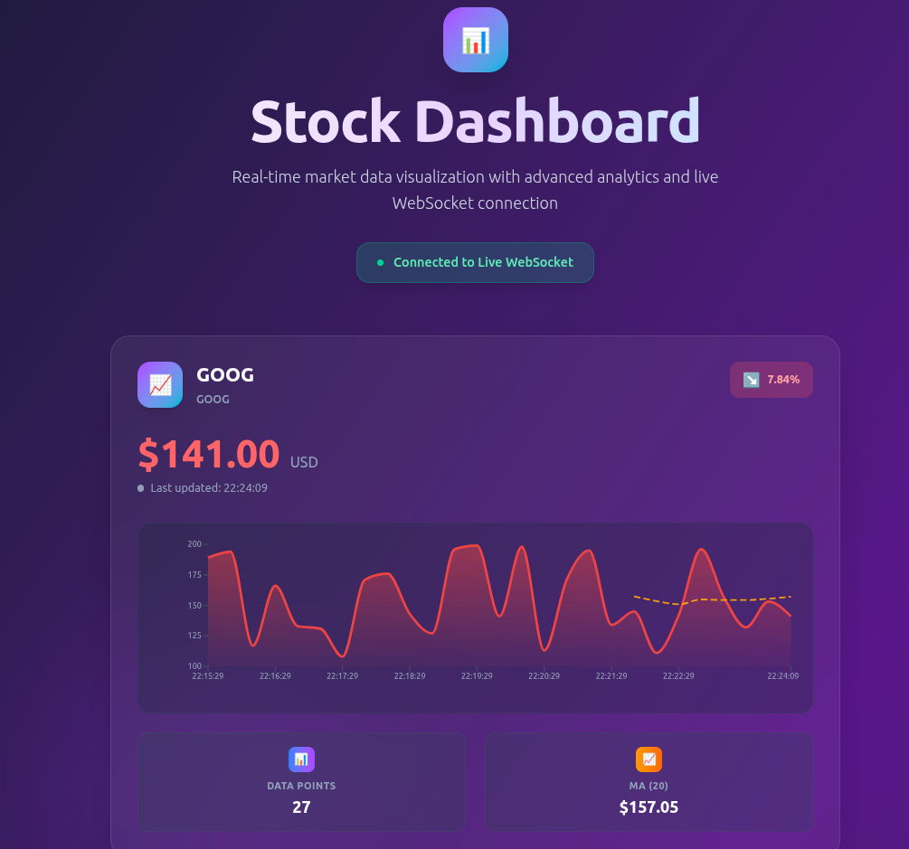

# 🚀 Multithreaded Stock Price Simulator


A high-performance, **real-time stock price simulator** using a **multithreaded C++ backend** and a modern **React frontend**.

The backend leverages a **thread pool** and a producer-consumer model to efficiently generate and broadcast live stock price updates. The frontend consumes this data over **WebSockets** and displays it in a beautiful, responsive dashboard with interactive charts.

---

## 📊 Demo Preview

This is the final user interface, featuring a "glassmorphism" design with live-updating charts.



---

## ✨ Features

-   🚀 **High-Performance C++ Backend**
    -   **Thread Pool Architecture** to efficiently manage hundreds of stock simulations.
    -   **Producer-Consumer Model** for clean separation of data generation and broadcasting.
    -   **Thread-safe queue** using mutexes & condition variables to guarantee data integrity.
-   🎨 **Modern Glassmorphism UI**
    -   **Instant-loading dummy graphs** that seamlessly transition to live data.
    -   Beautifully styled charts from **Recharts** with live price-change indicators.
    -   Fully responsive design built with **React and Tailwind CSS**.
-   ⚡ **Real-Time Communication**
    -   Low-latency data streaming from backend to frontend using **WebSockets**.

---

## 🛠️ Tech Stack

### Backend
-   **C++17**
-   **Multithreading** (`std::thread`, `std::mutex`, `std::shared_mutex`, `std::condition_variable`)
-   **Thread Pool** Design Pattern
-   **WebSocket++** Library

### Frontend
-   **React + Vite**
-   **Tailwind CSS** for styling
-   **Recharts** for interactive charts
-   **WebSocket Client** (`useRef` for stable connection)

---

## 🏗️ Architecture

```plaintext
        ┌────────────────────────┐
        │   Scheduling Thread    │
        │(Submits tasks per stock)│
        └───────────┬────────────┘
                    │ Tasks
                    ▼
      ┌───────────┐   ┌────────────────────────┐
      │ Task Queue│<--│   Thread Pool (Workers)│
      └───────────┘   │ (Run simulation tasks) │
                      └───────────┬────────────┘
                                  │ StockEvents
                                  ▼
                    ┌────────────────────────┐
                    │ Event Queue (Thread-Safe)│
                    └───────────┬────────────┘
                                │
                                ▼
                    ┌────────────────────────┐
                    │    Consumer Threads    │
                    │ (Broadcasts via WebSocket)│
                    └───────────┬────────────┘
                                │
                                ▼
                      ┌──────────────────┐
                      │  React Frontend  │
                      └──────────────────┘
